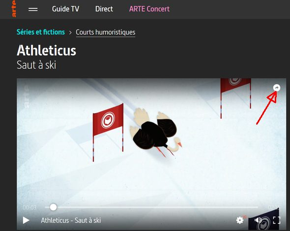
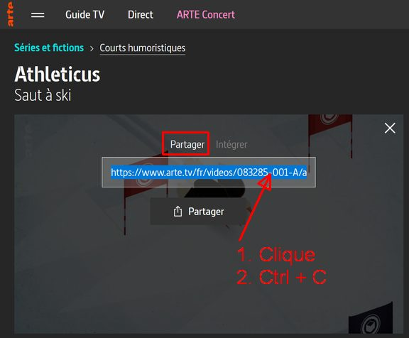

# ArteDownloader
## *Purpose (English)*
A short python3 script to download easily a replay video from Arte website (ARTE +7)

## Objectif
Un petit script python3 pour télécharger facilement une vidéo en replay depuis le site Web d'Arte (ARTE +7)

## *Limitations (English)*
- For the moment, download only the **hight quality french version** of the video (SQ_1).
    - in the future this could be setup by command line switch. 
- Simplest download feature : no kind of optmisation nor recovery in case of failure.
    - For instance I noticed that if the network is lost for too long time, the download can stall for ever.
- Require **Python 3** installed (no compile avalable right now)

## Limitations
- Pour le moment, télécharge uniquement la **version française de haute qualité** de la vidéo (SQ_1).
     - A l'avenir, cela pourrait être configuré par un commutateur de ligne de commande.
- Fonction de téléchargement simplicime : aucune espèce d'optimisation ni système de récupération en cas d'erreur réseau.
     - Par exemple, j'ai remarqué que si le réseau est perdu pendant trop longtemps, le téléchargement peut stagner éternellement.
- Nécessite d'avoir **Python 3** installé (pas de compilation disponible pour le moment)

## Installation (Windows)
Parant du principe que vous avez [*python*](https://www.python.org/downloads/) dans le $PATH :
- Enregistrez le fichier [ArteDL.py](https://raw.githubusercontent.com/nicos99/ArteDownloader/master/ArteDL.py) sur votre ordinateur (via *CTRL + S* une fois le script affiché) dans un dossier dédié comme '*D:\\ArteDL*'.
- Créez un raccourci sur votre bureau :
    - *bouton droit* > *Nouveau* > *Raccourci*,
    - entrez `python` dans le champs "*Entrez l'emplacement de l'élément :*" puis cliquez sur "*Suivant*",
    - entrer `Arte downloader` dans le champs "*Entrez un nom pour ce raccourci :*" puis cliquez sur "*Terminer*".
- Editez le raccourcis via *bouton droit* dessus > *Propriété* pour le lier au script :
    - allez au bout du champs "*cible*", ajouter un espace, `-i`, un autre espace suivi du chemin complet sur le script python (entre guillements si le chemin comporte des espaces).
        - Ex de cible : `C:\Users\(...)\Python36-32\python.exe -i D:\ArteDL\ArteDL.py`
    - remplacer le champs "*Démarrer dans :*" par le dossier dans lequel vous voulez trouver la vidéo.
        - Ex1 : `D:\ArteDL`
        - Ex2 : `%userprofile%\Downloads`
    - valider par "*OK*"

## Usage
### Principe
Il faut exécuter le script en fournissant l'URL de partage de la vidéo, ou en la collant lorsque le scrit la demmande.
`ArteDL.py [<URL de partage de la vidéo>]`
La vidéo est alors téléchargée dans le dossier courant.
### Via le raccourci Windows
- Dans votre navigateur Internet affichez la page de la vidéo à télécharger.
- Copiez le lien partageable à partir du bouton *"Partager"* présent en haut à droite de la vidéo.
    - 
    - 
- Double-cliquez sur le raccourci créé sur votre bureau à l'étape d'installation.
- Collez le lien demandé par le script (par un *bouton droit*) et valider par \[*Entrer*\] !.

Voici ce que cela doit donner par exemple pour un dossier de travail `%userprofile%\Downloads` :  

	shared_link ? : https://www.arte.tv/fr/videos/083285-001-A/athleticus/
	Get video info for 'https://www.arte.tv/fr/videos/083285-001-A/athleticus/'...
	> video id : 083285-001-A
	> Full Title : Athleticus - Saut à ski
	> HTTPS_SQ_1 : mp4 1280x720 2200bps - Version originale
	Dowloading 'Athleticus - Saut à ski.mp4' (from https://arteptweb-a.akamaihd.net/am/ptweb/083000/083200/083285-001-A_SQ_0_VO_04377569_MP4-2200_AMM-PTWEB_1AeJFgNEtb.mp4)...
	> Downloading   39 MO
	> Downloaded    37 MO [95.0%] at 18.833 MO/s
	Completed ! :-)
	The file is here : C:\Users\nicos\Downloads\Athleticus - Saut à ski.mp4
	>>>

# Remarques
Ce mini projet amateur est plus une occasion de pratiquer Python 3 qu'une volonter de suplanter un outil existant. Vous pouvez vous tourner vers l'extention "*Video DownloadHelper*" de FireFox par exemple pour un outils plus complet (\*). Il existe également sur GitHub d'autres projets similaires ou qui ont le même objectif.

Bien que les risques soient limités, je décline toute responsabilité en cas de disfonctionnement.

N'ésitez pas à revenir vers moi pour toute remarque, bug, suggestion, remerciment, encouragement, etc.

Nicolas.

(\*) : bien que pour Arte la vidéo que j'obtiens en utilisant cette extention comporte étrangement un framerate à 24,97 fps au lieu de 25.0, ce qui entraine des sacades à la visualisation, bug peut-être corriger depuis...
